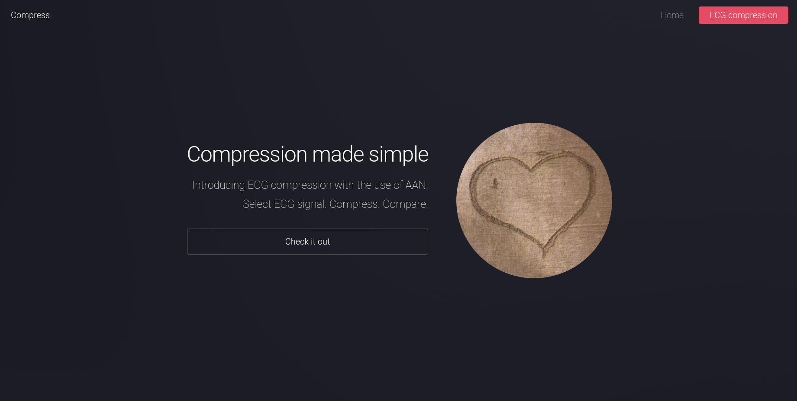
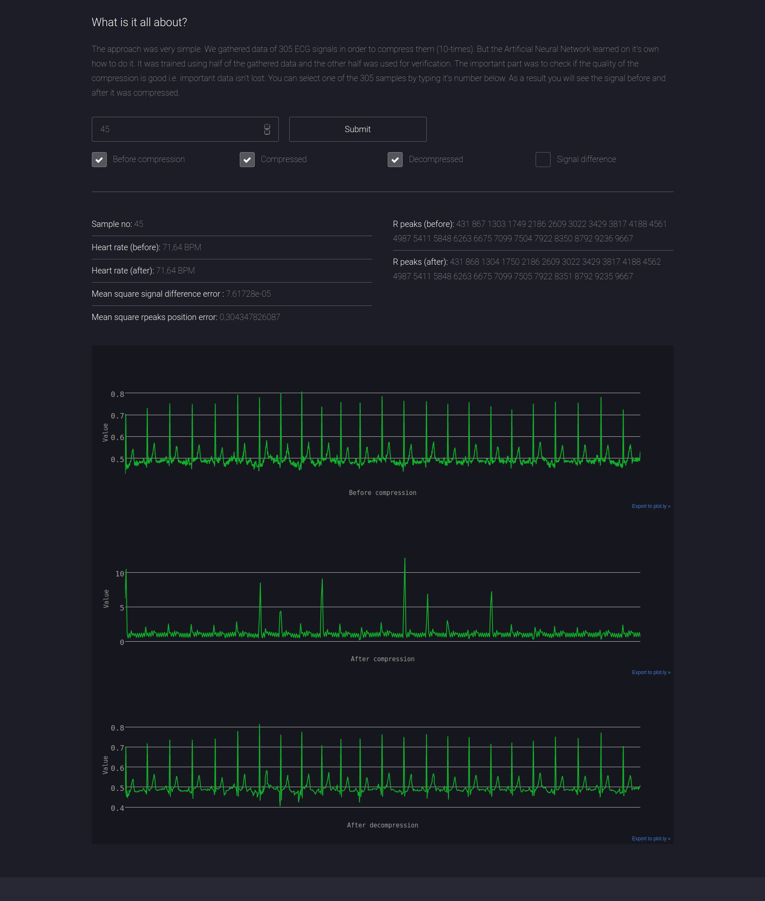

# Compression made simple with Artificial Neural Networks

This repository contains a Django web app for compressing ECG signals with the use of Artificial Neural Networks
(in Tensorflow). We gathered data of 305 ECG signals in order to compress them (by a factor of 10), but the Artificial
Neural Network learned on it's own how to do it. It was trained using half of the gathered data and the other half
was used for verification. The important part was to check if the quality of the compression is good i.e. important
data isn't lost. You can select one of the 305 samples by typing it's number below. As a result you will see the 
signal before and after it was compressed.

# Installation

The easiest way to get you started is to use the Docker based setup. Make sure you have `Docker` and `docker-compose`
installed and just type in:

```
docker-compose up
```

This will build the container and directly start it on port 8000. Now you're ready to go and can navigate to
`http://localhost:8000`.

---



